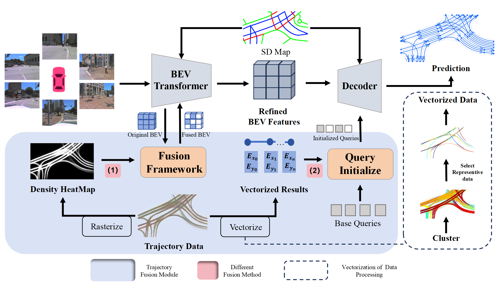

<div align="center">

# Enhancing Lane Segment Perception and Topology Reasoning with Crowdsourcing Trajectory Priors

[](https://arxiv.org/abs/2411.17161)


</div>


## News
- **`[2024/11]`** TrajTopo [paper](https://arxiv.org/abs/2411.17161) is available on arXiv. Code is also released!

---



<div align="center">
<b>Overall pipeline of LaneSegNet</b>
</div>
<!-- 
## Table of Contents

- [Installation](#installation)
- [Prepare Dataset](#prepare-dataset)
- [Train and Evaluate](#train-and-evaluate)
- [License and Citation](#license-and-citation)
 -->

<!-- ## Prerequisites

- Linux
- Python 3.8.x
- NVIDIA GPU + CUDA 11.1
- PyTorch 1.9.1 -->

## Get Trajectory data from Argoverse2
The pipeline consists of the following steps:

1. **Extract CSV files from Argoverse2**:  
   Run `TrajTopo/get_traj_from_src/get_csv_from_argv2.py` to extract trajectory data from Argoverse2 and save it as CSV files.

2. **Convert CSV to PKL**:  
   Run `TrajTopo/get_traj_from_src/csv-pkl.py` to consolidate the CSV files into a single PKL file.

3. **Get log id info**:  
   Run `TrajTopo\get_traj_from_src\get_city_log_id_info.py` to get the log info.

4. **Generate JSON files**:  
   Use the provided `process_city_data.py` script to process the PKL file and generate the final JSON files.


## Trajectory Data Process

This module provides tools for processing trajectory data, including **Rasterize Process** and **Vectorize Process**. Below are the details and instructions for running each part.

---

### 1. Rasterize Process

The Rasterize Process converts trajectory data into a heatmap representation.

Run the following Python script:
```
python trajectory_process/raster_trajectory/trajectory_raster_heatmap.py
```

### 2. Vectorize Process
The Vectorize Process clusters trajectory data using different algorithms. Two algorithms are supported: **FarSampling** and **KMeans**.

#### (1) FarSampling Algorithm
Run the following Python script:
```
python trajectory_process/cluster_trajectory/far_sample_multi_process.py
```

#### (2) KMeans Algorithm
Run the following Python script:
```
python trajectory_process/cluster_trajectory/KMeans_main_multi_process.py
```


<!-- ## Installation

We recommend using [conda](https://docs.conda.io/en/latest/miniconda.html) to run the code.
```bash
conda create -n lanesegnet python=3.8 -y
conda activate lanesegnet

# (optional) If you have CUDA installed on your computer, skip this step.
conda install cudatoolkit=11.1.1 -c conda-forge

pip install torch==1.9.1+cu111 torchvision==0.10.1+cu111 -f https://download.pytorch.org/whl/torch_stable.html
```

Install mm-series packages.
```bash
pip install mmcv-full==1.5.2 -f https://download.openmmlab.com/mmcv/dist/cu111/torch1.9.0/index.html
pip install mmdet==2.26.0
pip install mmsegmentation==0.29.1
pip install mmdet3d==1.0.0rc6
```

Install other required packages.
```bash
pip install -r requirements.txt
```

## Prepare Dataset

Following [OpenLane-V2 repo](https://github.com/OpenDriveLab/OpenLane-V2/blob/v2.1.0/data) to download the **Image** and the **Map Element Bucket** data. Run the following script to collect data for this repo. 

## Train and Evaluate -->


## License and Citation
All assets and code are under the [Apache 2.0 license](./LICENSE) unless specified otherwise.

If this work is helpful for your research, please consider citing the following BibTeX entry.

``` bibtex
@article{jia2024enhancing,
  title={Enhancing Lane Segment Perception and Topology Reasoning with Crowdsourcing Trajectory Priors},
  author={Jia, Peijin and Luo, Ziang and Wen, Tuopu and Yang, Mengmeng and Jiang, Kun and Cui, Le and Yang, Diange},
  journal={arXiv preprint arXiv:2411.17161},
  year={2024}
}

```

